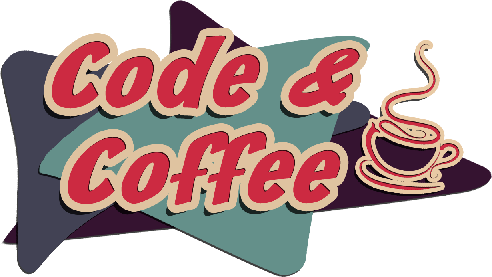

= baldwinpark-code-and-coffee image:https://img.shields.io/badge/License-MIT-yellow.svg[MIT License, link=https://opensource.org/licenses/MIT] image:https://img.shields.io/badge/PRs-welcome-brightgreen.svg?style=flat-square[PRs Welcome, link=http://makeapullrequest.com]
:toc: macro

toc::[float="left"]

== Interactive tutorials
[cols="4,14,4a,3a", options="header", frame=none, grid=none]
|===
|Name
|Description
|UI
|Offline

|https://www.codecademy.com/[Codecademy]
|Free coding classes in 12 different programming languages including Python, Java, JavaScript (jQuery, AngularJS, React.js), Ruby, SQL, and Sass, as well as markup languages HTML and CSS.
|Browser
|No

|https://nodeschool.io[NodeSchool]
|Workshops that teach web software skills with Node.js.
|Command-line
|Yes, after npm install

|http://exercism.io[Exercism]
|Coding exercises, with test-driven development (TDD) style workflow, on 48 different programming languages.
|Command-line
|Yes, after npm install

|http://overthewire.org/wargames/bandit/bandit0.html[OverTheWire]
|Test your Command Line skills here!
|Command-line
|No

|https://ethernaut.zeppelin.solutions/[Ethernaut]
|A Web3/Solidity based wargame, inspired by https://overthewire.org[OverTheWire], played in the Ethereum Virtual Machine. Each level is a smart contract that needs to be 'hacked'.
|Browser
|No

|https://cryptozombies.io[CryptoZombies]
|Learn to code Ethereum dApps by building your own game.
|Browser
|No

|https://tour.golang.org/[golang]
a|A Tour of Go, the Google scripting language. If you want to run the tutorial locally, first install https://golang.org/doc/install[Go] then run:
----
$ brew install go
$ cat >> .bashrc << 'EOF'
$ export GOPATH="${HOME}/go"
$ export GOROOT="$(brew --prefix golang)/libexec"
$ export PATH="$PATH:${GOPATH}/bin:${GOROOT}/bin"
$ EOF
$ source .bashrc
$ go get golang.org/x/tour/gotour
$ gotour
----
|Browser, Command-line
|Yes, after Go install

|https://chartio.com/learn/sql/[PostgreSQL]
|An interactive SQLBox for you to follow along and play with writing queries. The SQLBox takes your input and runs it against a live PostgreSQL database that Chartio is hosting.
|Browser
|No

|===

'''

== References

=== Algorithms
 * https://imgur.com/gallery/voutF[Sorting Algorithms Visualized]

=== AI/Machine Learning
 * https://www.tensorflow.org/tutorials/[Get Started with TensorFlow]
 ** https://www.youtube.com/watch?v=2FmcHiLCwTU&vl=en[TensorFlow in 5 Minutes (tutorial) by Siraj Raval]
 * https://keras.io/[keras]

=== Command Line
 * https://www.learnenough.com/command-line-tutorial[Learn Enough Command Line to Be Dangerous]
 * `$ vimtutor`

=== Web Development
 * Django
 ** https://tutorial.djangogirls.org/en/[Django Girls Tutorial]
 * Ruby on Rails
 ** https://www.railstutorial.org/book[Ruby on Rails Tutorial by Michael Hartl]
 ** https://gist.github.com/jendiamond/5a26b531e8e47b4aa638[Rails Girls LA 2016]

'''

Want extra coding help? Join our https://learnteachcode.org/slack[Slack group].
