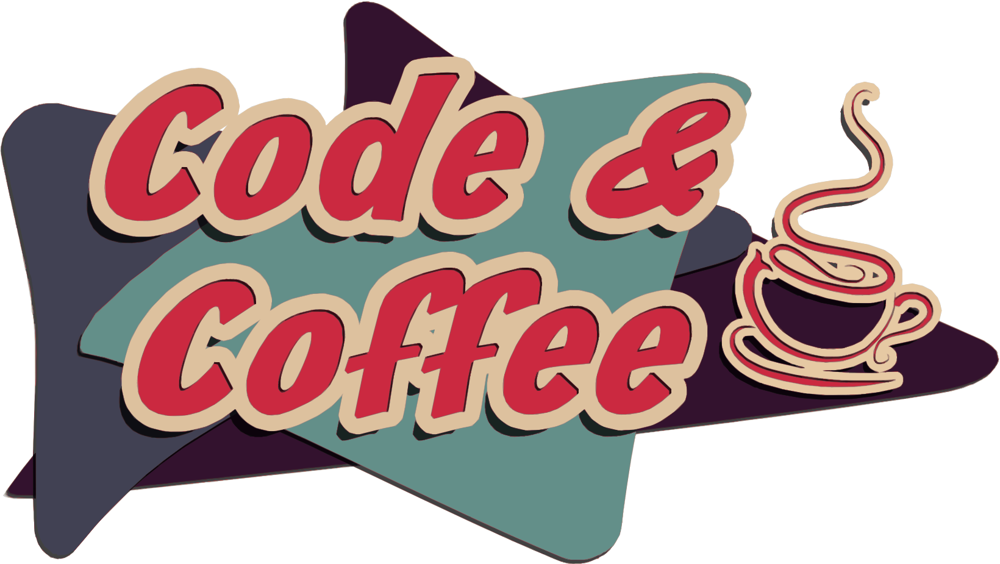

= code-coffee-compendium image:https://img.shields.io/badge/License-MIT-yellow.svg[MIT License, link=https://opensource.org/licenses/MIT] image:https://img.shields.io/badge/PRs-welcome-brightgreen.svg?style=flat-square[PRs Welcome, link=http://makeapullrequest.com] image:https://img.shields.io/badge/Edit%20on-GitHub-orange[Edit on GitHub, link=https://github.com/LearnTeachCode/code-coffee-compendium/edit/master/README.adoc]
:toc: left
:toclevels: 4

toc::[]

== Introduction
Welcome to the Code & Coffee Compendium GitHub repository! Maintained by the Baldwin Park study group, this page serves as a resource compendium for facilitating frequently asked questions from our meetup events. If you have any requests for particular resources, or would like to add one, please feel free to submit a https://github.com/LearnTeachCode/code-coffee-compendium/issues/new[new issue] or create a https://help.github.com/en/articles/creating-a-pull-request-from-a-fork[pull request]!

Note: this README is written in the AsciiDoc markup language (see https://asciidoctor.org/docs/asciidoc-syntax-quick-reference[AsciiDoc Syntax Quick Reference]).

== Interactive Lessons & Challenges

=== Learn a Tech Stack

Learn a tech stack by doing interactive tutorials. Tech stacks can include, but are not limited to, programming languages (s.a., Python, Javascript, Golang, SQL) or frameworks (s.a., Node, React, Sass).

[%header,cols=3] 

|===
|Name |Description |Requirements

|https://www.freecodecamp.org/[freeCodeCamp.org]
|Learn web development. Build projects. Earn certifications in Responsive Web Design, JavaScript Algorithms and Data Structures, Front End Libraries, Data Visualization, APIs and Microservices, and Information Security and Quality Assurance.
|Browser & Internet

|https://www.codecademy.com/[Codecademy]
|Free coding classes in 12 different programming languages including Python, Java, JavaScript (jQuery, AngularJS, React.js), Ruby, SQL, and Sass, as well as markup languages HTML and CSS.
|Browser & Internet

|https://github.com/jlord/git-it-electron/[git-it]
|Learn Git and GitHub basics.
|Download the https://github.com/jlord/git-it-electron/releases[latest desktop app release].

|https://nodeschool.io[NodeSchool]
|Workshops that teach web software skills with Node.js.
|Command-line, https://nodejs.org/en/[Node.js], & a Text-Editor

|https://tour.golang.org/[golang]
a|A Tour of Go, the Google scripting language. If you'd like to run the tutorial locally, first install https://golang.org/doc/install[Go], then run:
----
$ go get golang.org/x/tour
----
This will place the tour binary in your workspace's bin directory.
|Browser & Internet

|https://chartio.com/learn/sql/[PostgreSQL]
|An interactive SQLBox for you to follow along and play with writing queries. The SQLBox takes your input and runs it against a live PostgreSQL database that Chartio is hosting.
|Browser & Internet

|https://regexone.com/[RegexOne]
|Learn Regular Expressions with simple, interactive exercises.
|Browser & Internet

|https://cryptozombies.io[CryptoZombies]
|Learn to code Ethereum dApps by building your own game.
|Browser & Internet
|===

=== Interactive Coding Challenges

[%header,cols=3] 

|===
|Name |Description |Requirements

|http://exercism.io[Exercism]
|Coding exercises, with test-driven development (TDD) style workflow, on 48 different programming languages.
|Command-line, https://nodejs.org/en/[Node.js], & a Text-Editor

|https://leetcode.com/[LeetCode]
|800+ coding challenges to prepare for technical interviews
|Browser & Internet

|https://github.com/donnemartin/interactive-coding-challenges[interactive-coding-challenges]
|120+ continually updated, interactive, and test-driven coding challenges, with Anki flashcards.
|https://jupyter.org/install[Jupyter Notebook]
|===

=== Capture the Flag (CTF) 

Capture the Flag (CTF) challenges for learning security concepts and developing command line skills.

[%header,cols=3] 

|===
|Name |Description |Requirements

|http://overthewire.org/wargames/bandit/bandit0.html[OverTheWire]
|Test your Command Line skills here!
|Command-line & Internet

|https://www.hackthebox.eu/[hackthebox]
|Hack The Box is an online platform allowing you to test your penetration testing skills and exchange ideas and methodologies with thousands of people in the security field. Click below to hack our invite challenge, then get started on one of our many live machines or challenges.
|Browser (with Javascript console) & Internet

|https://ethernaut.zeppelin.solutions/[Ethernaut]
|A Web3/Solidity based wargame, inspired by https://overthewire.org[OverTheWire], played in the Ethereum Virtual Machine. Each level is a smart contract that needs to be 'hacked'.
|Browser & Internet
|===

=== Interactive Sandbox Environments

[%header,cols=3] 

|===
|Name
|Description
|Requirements

|https://chinook.ml/[chinook.ml]
|A sandbox environment for trying out PostgreSQL queries. Has a preloaded database to play around with.
|Browser & Internet

|https://repl.it/[repl.it]
|Test out code without opening an IDE. Large selection of popular languages to work with. Just code it and run it.
|Browser & Internet
|===

'''

== References

Cheatsheets, reference material for tech stacks & computer science concepts.

=== Algorithms, Data Structures, & Big O Notation
 * https://imgur.com/gallery/voutF[Sorting Algorithms Visualized]
 * https://www.toptal.com/developers/sorting-algorithms[Sorting Algorithms Animations]
 * https://github.com/TheAlgorithms/Python[All algorithms implemented in Python (for education)]
 * http://cooervo.github.io/Algorithms-DataStructures-BigONotation/index.html[big O cheat sheet]
 * http://jeffe.cs.illinois.edu/teaching/algorithms/[A Free Advanced Comprehensive Algorithm Textbook]

=== Career Advice
 ** https://blog.alicegoldfuss.com/how-to-get-into-sre/[How to Get Into SRE]

=== Command Line
 * `$ vimtutor`

=== Data Science
 * https://github.com/MrMimic/data-scientist-roadmap[Data Science Roadmap]

==== Discrete Math
 * http://mfleck.cs.illinois.edu/building-blocks/index-sp2018.html[An Undergrad Level Introduction to Discrete Math] 

==== Linear Algebra
 * https://github.com/fastai/numerical-linear-algebra[Computational Linear Algebra]
 * http://arminstraub.com/teaching/linearalgebra-fall14[Introduction to Applied Linear Algebra]

==== Machine Learning
 * https://www.deeplearningbook.org/[The Deep Learning Textbook]
 * https://www.tensorflow.org/tutorials/[Get Started with TensorFlow]
 * https://keras.io/[keras]

==== Statistics
 * http://www-bcf.usc.edu/~gareth/ISL/[An Introduction to Statistical Learning (with Applications in R)]
 * https://daviddalpiaz.github.io/stat400sp18/[Introduction to Discrete and Continious Probability and Statistics]

=== Information Security (InfoSec)
 * https://www.hacksplaining.com/[Hacksplaining]

=== Python
 * https://realpython.com/python-virtual-environments-a-primer/[Python Virtual Environments: A Primer]
 * https://automatetheboringstuff.com/[Automate the Boring Stuff with Python]
 * https://inst.eecs.berkeley.edu/~cs61a/sp18/[Rigorous Introductory Course to Python and Computer Science]

=== Software Engineering

==== Design Patterns
 * https://www.oodesign.com[Object oriented design patterns]
 * https://github.com/fbeline/design-patterns-JS[23 Design Patterns Implemented in Javascript]
 * https://github.com/faif/python-patterns[A collection of design patterns and idioms in Python]

==== Distributed Version Control
 * https://ohshitgit.com/[Oh shit, git!]
 * http://think-like-a-git.net/[Think Like (a) Git]

==== Command-Line Utilities
 * https://cookiecutter.readthedocs.io/en/latest/readme.html[Cookiecutter]: A command-line utility for creating boilerplate project files from cookiecutters (project templates).

==== Open Source
 * https://opensource.guide/how-to-contribute/[How to Contribute to Open Source]

==== Pair Programming
 * https://gist.github.com/rouzbeh84/4bafc9fe4fe02edf506d11997c4674b0[Resources for pair programming remotely and on site]

==== System Design
 * https://github.com/donnemartin/system-design-primer[The System Design Primer]: Learn how to design large-scale systems. Prep for the system design interview.

=== Web Development

==== Django
 ** https://tutorial.djangogirls.org/en/[Django Girls Tutorial]

==== Ruby on Rails
 ** https://www.railstutorial.org/book[Ruby on Rails Tutorial by Michael Hartl]
 ** https://gist.github.com/jendiamond/5a26b531e8e47b4aa638[Rails Girls LA 2016]
 
==== Flask
 ** https://blog.miguelgrinberg.com/post/the-flask-mega-tutorial-part-i-hello-world[Flask Mega Tutorial by Miguel Grinberg]
 ** https://flask.palletsprojects.com/en/1.1.x/tutorial/[Offical Flask Tutorial from the Flask Documentation]

'''

Want extra coding help? Join our https://learnteachcode.org/slack[Slack group].
